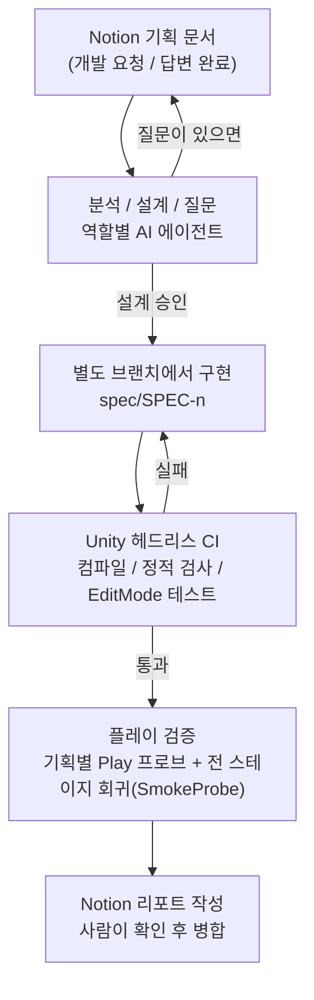

# Re:Trap (리:트랩)

함정을 깔고, AI가 뚫어 보고, 바뀐 함정을 내가 직접 뚫는 **2D 로그라이트 퍼즐 플랫포머**입니다.
Unity 6 URP 2D로 혼자 개발하고 있으며, 기획 문서만 쓰면 설계부터 구현, 검증, 리포트까지 자동으로 돌아가는 **기획 -> 개발 자동화 파이프라인**을 함께 만들고 있습니다.

<!-- 플레이 GIF나 스크린샷을 여기에 넣으면 좋습니다:  -->

| 항목 | 내용 |
|---|---|
| 엔진 | Unity 6 (6000.3.10f1), URP 2D |
| 언어 | C# (약 2만 2천 줄, 네임스페이스 `ReTrap`) |
| 상태 | 개발 중 (2026.05 ~ ) |
| 개발 | 1인 (기획, 클라이언트, 자동화) |

---

## 게임 소개

한 스테이지는 세 단계로 진행됩니다.

1. **빌드** - 정해진 칸에 함정(가시, 화살 발사대, 낙하 해머)을 배치합니다.
2. **검증** - 성격과 이동 특성이 서로 다른 AI 무리가 원래 배치 그대로의 함정을 뚫으려고 시도합니다.
3. **플레이** - 함정마다 무작위로 변이(정상 / 불발 / 치명 / 이로운 효과)가 걸린 상태에서 플레이어가 직접 돌파합니다.

내가 만든 함정이 나를 막는 구조라서, 함정을 너무 세게 깔면 마지막에 내가 고생하게 됩니다.

---

## 이 저장소에서 보면 좋은 것: 기획 -> 개발 자동화

Notion에 기획 문서를 쓰고 상태를 '개발 요청'으로 바꾸면, 나머지는 자동으로 진행됩니다. 사람은 **기획을 쓰고, 설계를 승인하고, 결과를 병합하는 일**만 합니다.



### 무엇이 돌아가나

| 트랙 | 입력 (Notion) | 하는 일 |
|---|---|---|
| 설계 | 기획안 DB | 기획을 읽고 설계안을 쓰거나, 모호한 부분을 질문으로 돌려줌 |
| 구현 | 승인된 설계 | `spec/SPEC-n` 브랜치에서 구현 -> CI -> 실패 시 자동 수정 -> 리포트 |
| 버그 | 버그 DB | 수정 전에 **재현부터 확인**하고 커밋 -> `spec/BUG-n`에서 수정 -> 재현/회귀 검증 |
| 밸런스 | 밸런스 수치 표 | 허용된 항목만 스크립트로 반영 (`tools/balance`) |
| 플레이테스트 | 플레이테스트 표 | 스테이지별 자동 플레이 결과를 기록 (`tools/playtest`) |

### 설계하면서 신경 쓴 점

- **구현과 검증의 작성자를 나눴습니다.** 기능을 만든 에이전트가 자기 검증 코드까지 쓰면 같은 착각을 반복하기 때문에, Play 프로브는 구현과 분리해서 작성합니다.
- **검증을 두 겹으로 했습니다.** 기획별 프로브로 "이번 기능이 맞게 동작하는가"를 보고, `SmokeProbe`로 "기존 스테이지가 깨지지 않았는가"를 매번 확인합니다.
- **에디터를 켜 둔 채로도 CI가 돕니다.** CI와 구현은 각각 별도 git worktree에서 실행해 작업 중인 에디터와 충돌하지 않습니다.
- **비용과 품질을 나눠 맡겼습니다.** 넓게 찾고 정해진 대로 구현하는 일은 가벼운 모델이, 설계 판단과 리뷰는 무거운 모델이 맡습니다 (`CLAUDE.md`의 모델 라우팅 정책).
- **사람이 할 일이 생길 때만 알립니다.** 2시간마다 자동 실행되고, 실행이 겹치지 않게 잠금 파일로 막으며, 끝나고 병합된 브랜치는 스스로 정리합니다.
- **자동 커밋의 범위를 좁게 정했습니다.** 자동화는 `spec/*` 브랜치의 로컬 커밋까지만 하고, push와 main 병합은 항상 사람이 합니다.

관련 파일: [`.claude/skills/spec-cycle/`](.claude/skills/spec-cycle/) (트랙별 절차), [`tools/ci/`](tools/ci/) (CI, worktree, 프로브 실행 스크립트), [`.claude/agents/`](.claude/agents/) (역할별 에이전트 정의)

---

## 게임 코드 구조

```
Assets/_Project/
├─ Scripts/            런타임 코드 (ReTrap.Runtime)
│  ├─ Trap/            ITrap, TrapBase, 변이 관리(TrapMutationManager), 함정 3종
│  ├─ AI/              A* 길찾기, 검증 AI, 태그 기반 성격/이동 특성 11종, 웨이브 스폰
│  ├─ Map/             JSON 맵 로드, 타일 팔레트, 함정 슬롯, Addressables 로더
│  ├─ Player/          이동(코요테 타임, 점프 버퍼, 대시), 체력, 애니메이션 FSM
│  ├─ Meta/            재화, 연구 보드, 스테이지 진행
│  └─ ...              페이즈 관리(빌드/검증/플레이), 카메라, 사운드
├─ Editor/             맵 에디터 창, 맵 검증기, 프리팹/에셋 자동 세팅, CI 러너
└─ Tests/EditMode/     EditMode 테스트 (데미지, 길찾기, 태그 가중치, 밸런스 등)
Assets/StreamingAssets/Maps/   스테이지 JSON (stage_01 ~ 03)
tools/                 ci / balance / playtest 자동화 스크립트
```

- **함정은 인터페이스 + 추상 클래스로 통일**했습니다. 새 함정은 `TrapBase`를 상속하고 변이 규칙만 정하면 빌드/검증/플레이 세 단계에 그대로 들어갑니다.
- **AI 성격은 태그 조합(ScriptableObject)** 으로 만듭니다. 이동 특성(전력질주, 지그재그, 겁쟁이, 몽유병 등)과 이벤트 훅(피격 시 뒤로 물러나기, 방패 등)을 코드 수정 없이 섞어 새 AI를 구성합니다.
- **맵은 JSON 데이터**로 관리하고, 전용 에디터 창에서 그리고 저장 전에 규칙 위반을 검사합니다.

---

## 실행 방법

1. Unity **6000.3.10f1**로 프로젝트를 엽니다.
2. 메뉴 `ReTrap -> Setup -> 함정 프리팹+Build UI 세팅`으로 함정과 HUD 배선을 자동 구성합니다.
3. `Assets/_Project/ResourcceEX/Scenes/SampleScene.unity`를 열고 플레이합니다.

무인 검증(CI):

```powershell
powershell -ExecutionPolicy Bypass -File tools\ci\unity-ci.ps1 -Tests
# 결과: Logs/ci/ci-summary.json  (exit 0 PASS / 1 FAIL / 2 COMPILE_ERROR / 3 INFRA)
```

---

## 기술 스택

Unity 6, URP 2D, C#, Addressables, SpriteAtlas, Cinemachine, ScriptableObject, Unity Test Framework (EditMode), PowerShell, Notion API, Claude Code (멀티에이전트, Hook, Skill)

---

만든 사람: 김상은 (Unity 클라이언트 개발자) / [koox547@gmail.com](mailto:koox547@gmail.com)
